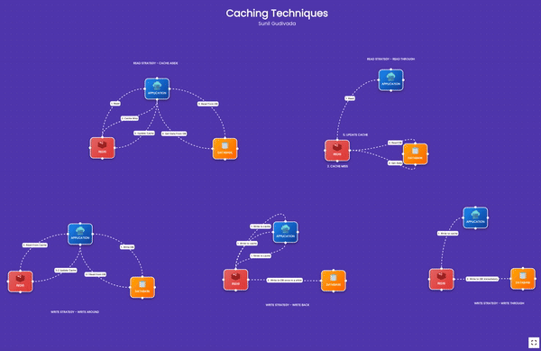

# 🔹 Cache

#### Interviewer Conversation on Caching Techniques

## **Introduction to Caching**

**Interviewer:** Can you briefly explain what caching is and why it’s important in system design?

**Candidate:** Caching is a technique used to store copies of frequently accessed data in a faster storage medium to improve performance and reduce latency. It’s crucial in system design because it helps in reducing the load on databases and backend services, leading to faster response times and improved scalability.

## **Caching Strategies**

**Interviewer:** What are some common caching strategies used in system design?

**Candidate:** Some common caching strategies include:

1. **Cache-Aside (Lazy-Loading):** Data is loaded into the cache only when it's requested. If the data isn’t in the cache, it’s fetched from the database and then stored in the cache for future requests.
2. **Write-Through Cache:** Data is written to both the cache and the underlying database simultaneously, ensuring that the cache is always up-to-date with the database.
3. **Write-Behind (Write-Back) Cache:** Data is written to the cache first and then asynchronously written to the database. This strategy can improve performance but requires careful handling of data consistency.

**Studio Link**: [https://studio.sunilgudivada.dev/flow/caching-techniques](https://studio.sunilgudivada.dev/flow/caching-techniques)

<figure><figcaption>
Caching Techinques
</figcaption></figure>

## **Cache Eviction Policies**

**Interviewer:** How do cache eviction policies work and why are they important?

**Candidate:** Cache eviction policies determine which items should be removed from the cache when it becomes full. They are important because they help manage memory usage and ensure that the cache remains efficient. Common policies include LRU , LFU , and FIFO . Choosing the right policy depends on the access patterns and specific requirements of the application.

## **Handling Cache Invalidation**

**Interviewer:** How do you handle cache invalidation to ensure data consistency?

**Candidate:** Cache invalidation is crucial to maintaining data consistency between the cache and the underlying data source. Techniques for cache invalidation include:

1. **Time-Based Expiration:** Data is automatically invalidated after a specified time period.
2. **Event-Driven Invalidation:** Cache entries are invalidated based on specific events, such as updates to the database or changes in application state.
3. **Manual Invalidation:** Developers explicitly remove or update cache entries when changes occur.

Each approach has its trade-offs and should be chosen based on the consistency requirements and performance considerations of the system.

## **Real-World Example**

**Interviewer:** Can you give an example of how you would implement caching in a real-world application?

**Candidate:** Sure! For an e-commerce website, I would use a cache-aside strategy to cache product details. When a user requests product information, the system first checks the cache. If the data is not found, it retrieves it from the database, stores it in the cache, and then serves the data to the user. I would also use a time-based expiration policy to ensure that product details are updated periodically. Additionally, I might use a write-through cache for critical data like user sessions to keep it in sync with the database.
